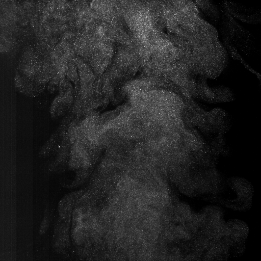
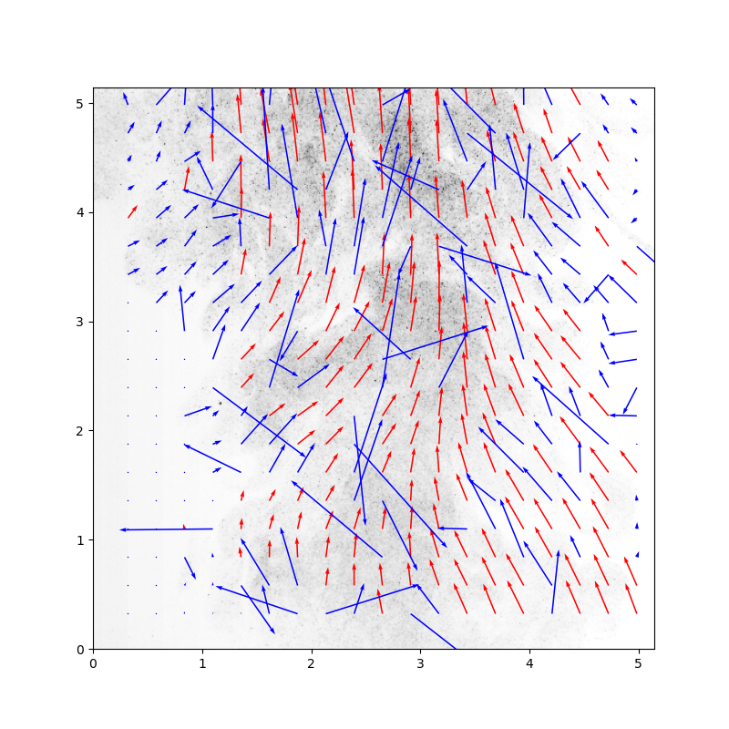

# Particle Image Velocimetry

Parçacıklarının hareket yönlerinin tespit edilmesini hedeflemekteyim. Bunun için OpenPIV isimli kütüphaneden faydalanarak bir deneme yapacağım. Amacım kameradan elde ettiğim görüntüler arasında ikişerli gruplar oluşturarak bu iki resim arasındaki farklı tespit etmek. Bu sayede hangi parçaçık hangi yöne ne kadar ne hızla gitmiş tespitini yapmış olabileceğim.

Daha önceden kayıtlı olan iki resim üzerinde gerçekleştirdiğim test için [buraya](./main.ipynb) tıklayabilirsiniz.
Daha önceden kayıtlı olan resimleri kullanarak video şeklinde yaptığım inceleme için [buraya](./test.py) tıklayabilirsiniz.
Gerçek zamanlı olarak kameradan aldığım görüntüler üzerinden yaptığım inceleme için [buraya](#) tıklayabilirsiniz.

## Kısa Özet

 

---

 

---

<!-- blank line -->
<figure class="video_container">
  <video controls="true" allowfullscreen="true" poster="./result/img_0.bmp">
    <source src="./result/video/output.avi" type="video/avi">
  </video>
</figure>
<!-- blank line -->

## License
[MIT](LICENSE)
